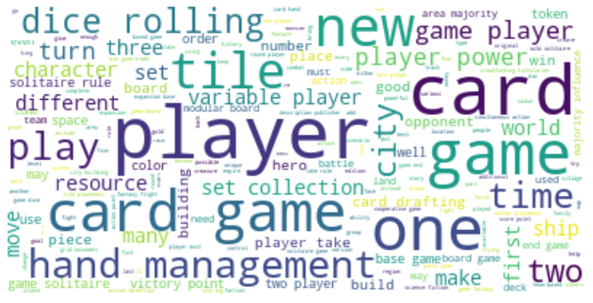

# Building Boardgame Recommendation Systems

### Abstract

For this project I am looking to improve the shopping experience when buying boardgames online. There is an extremely large number of boardgames that have been produced in the last 20 years, and it is difficult to find games that you might like among all of the noise. Furthermore, many of these games are relatively expensive and buying a boardgame that you don't like is a really unpleasant experience. Because of these issues, it is often safer from a customer standpoint to only buy a few games that you have played before. To increase sales, online retailers of boardgames can make use of recommendation systems to suggest games to customers similar to games they have played before, or rated similarly by other customers. I intend to build several types of recommendation systems and evaluate how effective they will be for future sales.

The dataset for this project consists of statistics for 119,978 boardgames and ~3.7 million reviews (~2000 reviews each for the 2000 games with the highest number of reviews) for the 2000 most popular games (defined by the most reviewed games). All of the data as obtained through the [boardgamegeek website](https://boardgamegeek.com/) directly using their api or using a handy python [wrapper](https://github.com/lcosmin/boardgamegeek). You can see how the data was obtained by looking through the scrapers folder.

Over the course of this project I will go over several types of recommendation systems and ultimately develop a NLP content-based recommendation system, a KNN collaboratively-filtered recommendation system, and a pyspark ALS recommendation system. It is highly recommended that an online retailer for boardgames makes use of at least one of these systems to connect customers with targeted games for sale.

### Data Distributions

The data was eventually cut down to just the information for the 2000 most popular games as I did not have the working memory to process the entire dataset. Here is a visualization of the distribution of games by number of ratings:

I actually have a fairly normal distribution here with most games having between 600 and 1000 reviews. Here is the average rating for each game:

We can see that the average rating fluctuates between 6 and 10. Taking a look at this information from the other side, here is a visualization of the distribution of users by number of ratings:

Most users have fewer than 100 reviews, but ther are some with as many as 1200. We should also take a look at the average ratings for each reviewer as well:

### Content-Based Recommendation Systems

This section will cover the NLP_content_based_recommendation.ipynb file. In this file, I built several content-based recommendation systems using some basic NLP techniques. I combined several columns of my descriptive statistics data together to create a bag of words for each of the 2000 games. To create a baseline model, I used a count vectorizer to transform each bag of words into a matrix and computed the similarities. I then followed the same steps using a tf-idf vectorizer instead. The recommendations from the tf-idf model were more unique to each game, so I deemed that to be the better model. To try and refine the models further I removed several columns from each bag of words and reran the models. There were no major effects on the output. Here is a wordcloud to show what the most repeated words were amongst all games:

### Collaborative-Filtering Recommendation Systems

In the collaborative_filtering_recommendation_system.ipynb notebook, I create two simple recommendation systems using collaborative-filtering. The first is a NearestNeighbors model which produced good recommendations, though there was no good way to test for error. Next, I created a model using singular value decomposition to decompose the rating matrix. This model also produced good recommendations. With a good deal of overlap between the recommendations of both models and no way of testing for error, these models would need to be tested in the field to determine a better model. I personally liked the KNN model, though the difference was pretty marginal.

In the final notebook for this project, spark_als_recommendation.ipynb, I built a recommendation system using ALS in pyspark. For this model I used RMSE for an evaluation metric. My baseline model had an error rating of 1.01, and after tuning parameters I was able to bring it down to 9.85.

### Conclusion

We have explored many different kinds of recommendation systems over the course of this project. First, we looked at using natural language processing to identify similar games based on the content of each game. We used two models for this approach a count vectorized model and a tf-idf vectorized model. We determined that the tf-idf model was stronger overall. Next we looked at two collaborative-filtering models. When given a game, these models will return several other games that are rated similarly by users who liked that game. The two collaborative-filtering models were more difficult to separate in regards to quality. Of the two, I prefer the KNN model, but both had good recommendations. And finally, we took a look at pyspark als to create new users and get recommendations based on user activity, and not on individual items.

While all models were deemed to be pretty effective, they all do slightly different things. I have three recommendations for the implementation of these models. First, I suggest using the tf-idf NLP model as a scrolling banner when selling boardgames. This will allow customers to see games that are similar to the game that they are currently considering purchasing. Second, I would suggest using the nearest neighbor model as a second banner indicating games that other customers liked. This will allow customers to see games that might be a bit different than what they are used to playing, but are thought very highly of by like minded people.  Finally, I suggest implementing the ALS model as a separate component of a business's webpage. By having a page where customers can rate their collections, we can offer them more personalized recommendations. Ultimately all of these models should help customers navigate the overwhelming number of boardgames for purchase and find games that they will enjoy.

### Future Work

There are several way that this project can be enhanced. The first and most obvious way is to gather more data. By filling in the rather sparse matrix with more reviews I will be able to finely tune the models and provide better recommendations. Second, I can test the knn and svd collaborative-filtering models. By gathering user feedback on the recommendations provided by those models, I can better evaluate the recommendations and tune the parameters. And finally I can further adjust the content-based system by further adjusting the tokens used for NLP. If I more closely monitor which tokens I am using, I might be able to create recommendations that are not mostly expansions and reprints.

### Files

Here is a summary of the organization of this repository:

data - Folder containing three zipped folders that hold all datasets used in this project. If the scrapers and preliminary_cleaning.ipynb are run, these files will be recreated.

images - Folder containing several graphs plotted over the course of the project.

py_scripts - Folder containing scripts that have helper functions for various notebooks written in them.

scrapers - Contains the data aquisition process for this project. First run statistics_scraper. This will produce several csv files that preliminary_cleaning.ipynb will convert into dataframes. These dataframes are then used by rating_scraper and description_scraper to scrape the rest of the data.

NLP_content_based_recommendation.ipynb - Notebook in which I create content-based recommendation systems.

collaborative_filtering_recommendation_system.ipynb - Notebook in which I create simple collaborative-filtering recommendation systems.

spark_als_recommendation.ipynb - Notebook in which I create a recommendation system using pyspark.